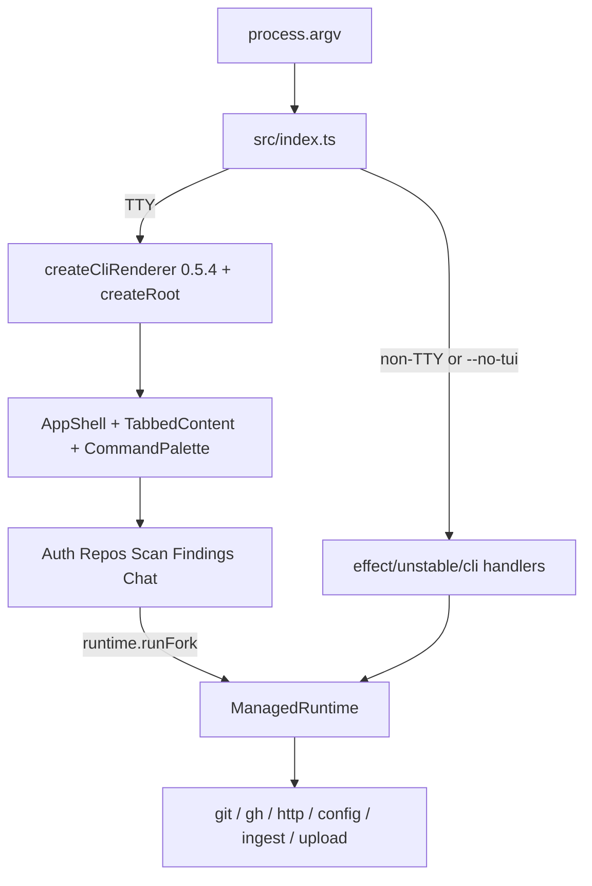

# Design: OpenTUI + termcn dashboard (Effect v4)

Status: draft for review. Product shape: **full-screen TUI is primary UX**. Subcommands stay as optional deep-links plus a non-TTY / `--no-tui` fallback.

Pinned to **aftermerge's Effect v4 RC**, not npm `latest` (that is still Effect 3). OpenTUI/React use current npm latest. aftermerge `e3ab618` (`4.0.0-beta.102` → `4.0.0-rc.111`; D28).

## Versions

Checked 2026-08-21 against npm dist-tags, the published tarballs (`npm pack` + `exports` field), and [`~/Personal/aftermerge/package.json`](../../aftermerge/package.json) catalog.

| Package | CLI today | Plan | Source |
| --- | --- | --- | --- |
| `effect` | `^3.22` (3.22.0) | **`4.0.0-rc.111`** exact | aftermerge catalog (D28, `e3ab618`). npm `latest` is still 3.22.1; `beta` is 4.0.0-beta.107; `rc` is 4.0.0-rc.111 |
| `@effect/opentelemetry` | — | not needed | aftermerge catalog has `4.0.0-rc.111` if we ever add it |
| `@effect/cli` | `^0.76.0` | **delete** | v3-only (`@effect/cli@0.77.0` still peers `effect@^3.22`). v4 CLI is `effect/unstable/cli` |
| `@effect/platform` | `^0.97.0` | **delete** | folded into `effect/unstable/http` (+ `Terminal` / `FileSystem` / `Path` moved to effect core) |
| `@effect/platform-bun` | `^0.91.0` (v3) | **`4.0.0-rc.111`** | must be in the `bun remove` line too — the v3 pin is still in `package.json`. rc.111 peers `effect@^4.0.0-rc.111`, ships `BunRuntime` / `BunServices` / `BunStdio` / `BunTerminal`. aftermerge itself does not depend on this package |
| `@opentui/core` | — | **`^0.5.4`** | npm latest. aftermerge `apps/tui` is still `^0.4.5` — **do not copy that pin** |
| `@opentui/react` | — | **`^0.5.4`** | must match core |
| `react` | — | **`^19.2.8`** | OpenTUI requires `>=19.2.0`. aftermerge catalog is `^19.2.8` |
| `web-tree-sitter` | — | **`0.25.10`** exact | listed peer of `@opentui/core@0.5.4`, exact pin, no `peerDependenciesMeta` → not optional |
| `ws` | — | **`^8.18.0`** | peer of `@opentui/react@0.5.4` |
| `react-devtools-core` | — | **`^7.0.1`** | peer of `@opentui/react@0.5.4` |
| `@napi-rs/keyring` | `^1.3.0` | **unchanged** | not an Effect dep; no v4 work. Called via dynamic `import("@napi-rs/keyring")` in `src/config.ts` (3 sites). Matters only for `--compile` — see [Release / compile](#release--compile) |
| termcn | — | copy-paste via `npx shadcn@latest add @termcn/opentui/...` | no runtime package. Registry `https://termcn.dev/r/{name}.json` **verified**: `opentui/table` and `opentui/app-shell` both 200 on `termcn.dev` (not `www`) |

aftermerge `apps/tui` is a hello-world shell (`createCliRenderer` + `createRoot`) plus an RpcClient smoke for `repos.list`. Steal its **tsconfig JSX** (`jsxImportSource: "@opentui/react"`), not its OpenTUI version.

Note: aftermerge's root `prepare` script (`scripts/prepare-effect.sh`) clones `Effect-TS/effect` into `.repos/effect`. Matching the version string is not automatically behavior parity if that checkout is ever consulted or patched against — worth one check before assuming lockstep.

### Verified v4 API surface

Confirmed by unpacking `effect@4.0.0-rc.111` and `@effect/platform-bun@4.0.0-rc.111`, so Phase 0 is not blocked on unknowns:

- `exports` maps `"./*": "./dist/*.js"`, so deep imports resolve: `effect/unstable/http/FetchHttpClient` ✅, `effect/unstable/cli/Prompt` ✅. Only `internal/*` paths are `null`-blocked.
- `effect/unstable/cli` ships `Command`, `Flag`, `Argument`, `Param`, `Prompt`, `CliError`, `CliOutput`, `Completions`, `GlobalFlag`.
- `Schema.TaggedError` exists (`dist/Schema.d.ts`). `Context.Service` exists (`dist/Context.d.ts`). `ManagedRuntime` is still shipped.
- `Terminal` is now in **effect core** (`effect/Terminal`), and `QuitException` is renamed **`QuitError`** / `isQuitException` → **`isQuitError`**. Barrel: `import { Terminal } from "effect"` then `Terminal.isQuitError`.
- `Command.run(cmd, { version, renderErrors? })` returns `Effect` and reads argv from `Stdio`. `Command.runWith(cmd, { version, renderErrors? })` returns `(argv) => Effect`. Today's `cli(process.argv)` maps to **`runWith`**.
- `BunRuntime.runMain` **still has** `disableErrorReporting?: boolean` in rc.111. That is not gone. `renderErrors: false` on `run`/`runWith` is a *second* printer (the CLI formatter). Keep both.
- `BunServices.layer` is the aggregate (`Layer<ChildProcessSpawner | Crypto | FileSystem | Path | Terminal | Stdio>`). That covers CLI `Environment` plus `Crypto`. Individual files also exist (`BunFileSystem`, `BunPath`, `BunStdio`, `BunTerminal`, `BunChildProcessSpawner`, `BunCrypto`).
- `@opentui/core@0.5.4` exports `./testing` (`createTestRenderer`). `OPENTUI_LIBC` is read from `process.env` in `getCurrentNodeAssetTarget()`; legal values `unset` / `""` / `"glibc"` / `"musl"`. `"gnu"` throws. Native packages static-listed: all 8 `optionalDependencies`.

## Problem

The CLI is line-oriented `@effect/cli` v3 plus `Console.log` / `Prompt`. There is no component tree, no progress UI, no findings table, and chat streams SSE with `process.stdout.write`. Interactive surfaces (`chat`, `scan --context`, `repos remove`, device-code login) feel bolted on.

The shipped CLI is also the consumer aftermerge still shims REST for: [`apps/web/src/lib/api/cli-compat.ts`](../../aftermerge/apps/web/src/lib/api/cli-compat.ts) exists because this repo is Effect v3 + `@effect/platform` v3 while aftermerge's RPC client is Effect v4. Porting this CLI to v4 is the first step of that sunset (aftermerge Phase 15). Switching list/whoami-style calls onto `/api/rpc` is **not** required to ship the TUI; chat stream, local scan, ingest upload, and device-code stay HTTP even in aftermerge's own RpcClient comments.

## Goal

`aftermerge` (no args, TTY) opens a full-screen terminal app built on [OpenTUI 0.5.4](https://opentui.com/docs/) and [termcn](https://www.termcn.dev/docs) React components. Effect v4 RC (`4.0.0-rc.111`) is the domain runtime, matching aftermerge. Existing subcommands become routes into that app, not a second UI.

## Decisions

| Decision | Choice | Why |
| --- | --- | --- |
| Product | Dashboard-first | Bare `aftermerge` is the app. Subcommands optional. |
| Framework | `@opentui/react@^0.5.4` | termcn is React-only. Not Solid. Not Ink. |
| termcn registry | `@termcn/opentui/*` only | Never `@termcn/ink/*`. |
| Effect | **`4.0.0-rc.111`**, match aftermerge D28 | Not 3.22. Not leftover beta.102. |
| CLI parser | `effect/unstable/cli` | `@effect/cli` cannot run on v4. |
| CLI entry fn | `Command.runWith(cmd, { version, renderErrors: false })(process.argv)` | v4 has both `run` (argv from the `Stdio` service, returns `Effect`) and `runWith` (explicit argv array). Today's `cli(process.argv)` maps to **`runWith`**. |
| Error rendering | **two knobs, keep both** | `BunRuntime.runMain(effect, { disableErrorReporting: true })` still exists in rc.111 — that is today's option, keep it. Separately, v4 CLI formatter prints parse/`UserError` unless `renderErrors: false` on `runWith`. Dropping either regresses to a double-printed Cause. |
| HTTP | `effect/unstable/http/FetchHttpClient` | Same import as aftermerge `packages/api/src/rpc-client.ts`. |
| Services | `Context.Service` + `Layer.effect` | aftermerge shape (`BillingService`, `VcsConnectionService`). Not v3 `Context.Tag`. |
| Errors | keep `Data.TaggedError` for CLI-internal (`ApiError`) | aftermerge: internal-only errors stay `Data.TaggedError`; RPC-wire errors use `Schema.TaggedError` (renamed from `TaggedErrorClass` in beta.104 / RC). CLI REST errors do not cross RPC yet. |
| Ownership | Effect owns work, React owns screens | Domain modules must not import React / OpenTUI. |
| Scripts | non-TTY or `--no-tui` | Line-oriented handlers so CI never takes over the terminal. Predicate is spelled out below — it is not "check `isTTY`". |
| RPC | later, not this plan | Stay on existing REST until TUI ships. Optional follow-on: typed `RpcClient` like `apps/tui/src/rpc.ts` for `repos.list` / findings. |

### TTY / `--no-tui` predicate

Not left to "non-TTY or `--no-tui`" — that under-specifies four real cases. Land this as actual code in `src/index.ts` before Phase 2:

```ts
// src/index.ts — argv sniff runs BEFORE effect/unstable/cli parses, so an
// unknown-flag error still reaches the line-oriented renderer, not a renderer
// that has already grabbed the terminal.
const wantsTui = (argv: readonly string[]): boolean => {
  const args = argv.slice(2)
  if (args.includes("--no-tui")) return false
  if (args.includes("--help") || args.includes("-h")) return false
  if (args.includes("--version")) return false
  if (process.env.CI) return false
  if (process.env.TERM === "dumb") return false
  // stdout drives the renderer; stdin drives Prompt/chat input. Need both:
  // `aftermerge chat < transcript.txt` must stay line-oriented.
  return Boolean(process.stdin.isTTY && process.stdout.isTTY)
}
```

`NO_COLOR` is deliberately **not** in the predicate — it means "no color", not "no UI"; pass it to the theme instead.

## Architecture



- One `ManagedRuntime.make(layer)` — same factory aftermerge uses in `packages/runtime/src/runtime.ts`.
- Views call `runtime.runFork` / `runtime.runPromise` (or `Effect.runForkWith(services)`).
- Long jobs (device-code poll, scan poll, chat SSE) are Fibers. Route change / `q` interrupts them (`Fiber.interrupt`).
- In-view prompts: a React component completes an Effect `Deferred`. Domain `yield*`s it — same shape as today's `Prompt.run`, without v3 `@effect/cli` Prompt.
- Live state (whoami, scan, chat): `SubscriptionRef` or a tiny store + `useSyncExternalStore`.

**The layer is not just `FetchHttpClient.layer`.** v4 `Command.run` / `runWith` require `Environment` = `FileSystem | Path | Terminal | ChildProcessSpawner | Stdio` (`Command.d.ts`). **`BunServices.layer` is the verified aggregate** (`@effect/platform-bun@4.0.0-rc.111` `BunServices.d.ts`): `ChildProcessSpawner | Crypto | FileSystem | Path | Terminal | Stdio`. Use that on the line-oriented / `--no-tui` path.

TUI path: OpenTUI owns the tty. Still need `FileSystem` / `Path` / `ChildProcessSpawner` / `Crypto` / `FetchHttpClient` for domain. Do **not** install `BunTerminal` / `BunStdio` on that branch if they grab stdin — compose the individuals instead of the aggregate. Decision lands in Phase 2.

```ts
// src/runtime.ts — line-oriented / --no-tui path
import { Layer, ManagedRuntime } from "effect"
import { layer as bunServicesLayer } from "@effect/platform-bun/BunServices"
import * as FetchHttpClient from "effect/unstable/http/FetchHttpClient"

export const AppRuntime = ManagedRuntime.make(
  Layer.mergeAll(FetchHttpClient.layer, bunServicesLayer),
)
```

```ts
// src/ui/Ui.ts — v4 Context.Service, not Context.Tag
import { Context, Effect, Layer } from "effect"

export class Ui extends Context.Service<Ui, {
  readonly confirm: (message: string) => Effect.Effect<boolean>
  readonly multiSelect: <A>(opts: ...) => Effect.Effect<A[]>
  readonly progress: (status: string) => Effect.Effect<void>
}>()("aftermerge-cli/Ui") {
  static readonly Live = Layer.succeed(this, /* OpenTUI adapter */)
}
```

OpenTUI adapter (`src/ui/opentui-ui.ts`) talks to React via Deferreds / a mailbox. Chat SSE stays as `readSseLines`; wrap as `Stream` or push into a `Queue` the Chat view drains. Drop `process.stdout.write` (`src/commands/chat.ts:102`, `:104`, `:143`).

Entry splits: `src/index.ts` (argv / runtime) + `src/ui/app.tsx` (shell). Command files stay Effect. They must not import React.

### v3 → v4 import map (this repo)

| Today | v4 |
| --- | --- |
| `import { Command, Prompt, Options, Args } from "@effect/cli"` | `import { Argument, Command, Flag } from "effect/unstable/cli"` — `Options` → `Flag`, `Args` → `Argument`. Prompt only until TUI replaces it (`effect/unstable/cli/Prompt`) |
| `import { FetchHttpClient } from "@effect/platform"` | `import * as FetchHttpClient from "effect/unstable/http/FetchHttpClient"` |
| `import { HttpClient, HttpClientRequest } from "@effect/platform"` | `effect/unstable/http` (`HttpClient`, request combinators) |
| `import { Terminal } from "@effect/platform"` | `import { Terminal } from "effect"` — **core**, not platform. `QuitException` → **`QuitError`**, `isQuitException` → **`isQuitError`**. 3 call sites: `src/prompt-utils.ts:21`, `src/gh.ts:68`, `src/commands/scan.ts:64` |
| `import { BunContext, BunRuntime } from "@effect/platform-bun"` | `import { runMain } from "@effect/platform-bun/BunRuntime"` + `import { layer as bunServicesLayer } from "@effect/platform-bun/BunServices"`. `BunContext` is gone. Deep imports work (`exports` `"./*": "./dist/*.js"`). |
| `Command.withHandler` / `Command.run(root, { name, version })` | `Command.make(name, flags, handler)` + **`Command.runWith(root, { version, renderErrors: false })(process.argv)`** then `Effect.provide(bunServicesLayer)` + `runMain(effect, { disableErrorReporting: true })`. The other overload is `Command.run(cmd, { version })` → `Effect` that reads argv from `Stdio`. v4 dropped the `name` field. |
| `BunRuntime.runMain(effect, { disableErrorReporting: true })` | **keep it** — still on `BunRuntime.d.ts` in rc.111. Also set `renderErrors: false` on `runWith` so the CLI formatter does not print a second copy. |
| `Options.text` / `Options.integer` / `Options.boolean` | `Flag.string` / `Flag.integer` / `Flag.boolean` |
| `Args.text` | `Argument.string` |
| `Context.Tag("Ui")<Ui, Shape>()` | `Context.Service<Ui, Shape>()("aftermerge-cli/Ui")` |
| `Effect.provide(FetchHttpClient.layer)` + `Effect.provide(BunContext.layer)` | `Layer.mergeAll` into `ManagedRuntime.make` / `Effect.provide` once |

Mechanical port of [`src/index.ts`](../src/index.ts), [`src/http.ts`](../src/http.ts), and every `Command.make` file happens **before** JSX. The line-oriented CLI must still run on v4.

## Screens

| Route | Today | termcn (OpenTUI) |
| --- | --- | --- |
| Shell | none | [AppShell](https://www.termcn.dev/docs/templates/opentui/app-shell), [TabbedContent](https://www.termcn.dev/docs/components/opentui/navigation/tabbed-content), [CommandPalette](https://www.termcn.dev/docs/components/opentui/navigation/command-palette) |
| Auth | logs in `src/commands/auth.ts` | Box + Badge + StatusMessage; poll Fiber; open browser |
| Repos | lines + confirm in `src/commands/repos.ts` | Table + Input + Confirm |
| Scan | logs + `multiSelect` in `src/commands/scan.ts` + `src/run.ts` | Spinner / ProgressBar + MultiSelect + findings Table |
| Findings | text in `src/commands/findings.ts` | Table; selectable row → Markdown detail |
| Chat | `Prompt.text` + SSE stdout in `src/commands/chat.ts` | [ChatThread](https://www.termcn.dev/docs/components/opentui/ai/chat-thread) + ChatMessage + TextInput |
| _(none)_ | `src/commands/analyze.ts` | **No route.** Stays CLI-only — it is a thin PR-scoped wrapper over `runLocalScan`, fully covered by the Scan view's `--pr` deep-link. Still needs the `Options.integer` → `Flag.integer` port in Phase 0. |

Command palette: Scan, Chat, Repos, Findings, Login/Logout, Quit.

Deep-links: `aftermerge chat` and `aftermerge scan --pr 12` open the TUI already on that route with those params.

## Keep vs rewrite

**Keep almost as-is (v4 import/API pass only):** `src/git.ts`, `src/http.ts` (`ApiError` stays `Data.TaggedError`), `src/config.ts`, `src/api-types.ts`, `src/ingest.ts`, `src/upload.ts`, `src/connected-repo.ts`, `src/browser.ts`, `src/url.ts`. Later, swap `Console.error` skip lines in upload for a `Ui.log` callback.

`src/config.ts` needs no Effect-v4 work for its keyring path (`@napi-rs/keyring` is dynamically imported and version-independent), but it is the reason the compiled binary already carries a native N-API module — see [Release / compile](#release--compile).

**Extract from Console/Prompt, then wrap:** `runLocalScan`, `waitForRun` / `printFindings`, device-code poll, chat SSE (`postChatTurn` / `readSseLines`). Progress goes through the `Ui` port, not `Console.log`.

**Replace:**

- `src/prompt-utils.ts` (`Terminal.QuitException` from v3 platform) — delete once no `Prompt` call sites remain.
- `src/gh.ts` — **not a keep-as-is file.** It imports `Prompt` from `@effect/cli` *and* `Terminal.isQuitException` (`src/gh.ts:68`), plus 5 `Console.*` calls for its install-plan flow. Same treatment as `prompt-utils.ts`: v4 `Terminal.isQuitError` in Phase 0, `Ui` port when the TUI lands.
- all `Prompt.*` call sites.
- `src/index.ts` boot.

**Port surface (so "mechanical" is not read as "small"):** 4 `Prompt.run` sites — `gh.ts` confirm, `scan.ts` multiSelect, `repos.ts` confirm, `chat.ts` text — plus 3 `Prompt.Prompt.Environment` type refs (`gh.ts` ×2, `scan.ts` ×1). `prompt-utils.ts` does not call `Prompt`; it only catches quit. `Console.*` in 9 files — `repos.ts` 16, `auth.ts` 13, `scan.ts` 8, `gh.ts` 5, `chat.ts` 5, `run.ts` 4, `findings.ts` 4, `prompt-utils.ts` 2, `upload.ts` 1. Three `process.stdout.write` in `chat.ts` (102, 104, 143).

## Toolchain

1. Effect v4 first (no TUI yet):

```bash
bun remove @effect/cli @effect/platform @effect/platform-bun
bun add effect@4.0.0-rc.111 @effect/platform-bun@4.0.0-rc.111
```

   `@effect/platform-bun` is in the remove line because the current pin is the v3 `^0.91.0`. Rewrite imports per the table above. `bun run src/index.ts --help` and a dry `auth whoami` must work.

2. OpenTUI + React — **including the three peers `bun add` will otherwise warn on**:

```bash
bun add @opentui/core@^0.5.4 @opentui/react@^0.5.4 react@^19.2.8 \
        web-tree-sitter@0.25.10 ws@^8.18.0 react-devtools-core@^7.0.1
```

   `web-tree-sitter` is an exact-pin peer of `@opentui/core` with no `peerDependenciesMeta`, so it is not optional. `ws` and `react-devtools-core` are peers of `@opentui/react`.

3. tsconfig. Current repo tsconfig shares almost nothing with `apps/tui`'s, so "mirror it" is more than three keys. Minimum additions: `"jsx": "react-jsx"`, `"jsxImportSource": "@opentui/react"`, `include` → `src/**/*.ts` **and** `src/**/*.tsx`. Deliberate diffs to decide, not inherit: `apps/tui` also sets `verbatimModuleSyntax`, `allowImportingTsExtensions`, `moduleDetection: "force"`, `noUncheckedIndexedAccess`, `noImplicitOverride`, `noFallthroughCasesInSwitch`. This repo is on `typescript@^6.0.3`; aftermerge's catalog is `^7.0.2`.

4. `components.json` registry: `"@termcn": "https://termcn.dev/r/{name}.json"`

5. Copy-paste via current shadcn, OpenTUI paths only. Registry `"@termcn": "https://termcn.dev/r/{name}.json"` is **verified live**: `https://termcn.dev/r/opentui/table.json` and `https://termcn.dev/r/opentui/app-shell.json` both serve registry items. Docs live on `www.termcn.dev`; the registry host is bare `termcn.dev`. The hyphenated `@termcn/opentui-app-shell` form is the wrong spec (that would request `/r/opentui-app-shell.json`).

```bash
npx shadcn@latest add @termcn/opentui/theme-provider
npx shadcn@latest add @termcn/opentui/app-shell
npx shadcn@latest add @termcn/opentui/tabbed-content
npx shadcn@latest add @termcn/opentui/command-palette
npx shadcn@latest add @termcn/opentui/table
npx shadcn@latest add @termcn/opentui/select
npx shadcn@latest add @termcn/opentui/multi-select
npx shadcn@latest add @termcn/opentui/text-input
npx shadcn@latest add @termcn/opentui/spinner
npx shadcn@latest add @termcn/opentui/progress-bar
npx shadcn@latest add @termcn/opentui/alert
npx shadcn@latest add @termcn/opentui/badge
npx shadcn@latest add @termcn/opentui/chat-thread
npx shadcn@latest add @termcn/opentui/markdown
```

   AppShell is a template in the docs, but it is published at the same `opentui/<name>` registry path as the components.

6. Hello-world: `createCliRenderer()` → `createRoot(renderer).render(<App />)` → `q` calls `renderer.destroy()`. Verify **before** wiring commands. Then `bun build --compile` smoke — on darwin-arm64 *and* linux-x64, for the reason in the next section.

## Release / compile

OpenTUI 0.5.4 ships platform native Zig libs as **optionalDependencies** of `@opentui/core`: `core-{darwin,linux,win32}-{x64,arm64}` plus `core-linux-{x64,arm64}-musl`. Current matrix in `.github/workflows/release.yml` already covers the three we ship (darwin-arm64, linux-x64, linux-arm64).

**Risk 1 — `bun --compile` against optionalDependencies.** `resolveNativeLibraryPath()` in `@opentui/core` static-lists all eight in one function body:

```js
if (process.platform === "darwin") {
  if (process.arch === "arm64") return (await import("@opentui/core-darwin-arm64")).default
  ...
}
```

CI runs `bun install --frozen-lockfile` on each runner, and the optional deps are `os`/`cpu`-gated — so on the linux-x64 runner, seven of the eight are simply not on disk while the bundler still has to resolve every one of those `import()` specifiers. This fails in tag-release CI, not on a dev Mac. **Phase 1 exit criteria must include a linux-x64 compile, not just the local darwin-arm64 one.**

**Risk 2 — `OPENTUI_LIBC` is a *runtime* variable, and `gnu` is not a valid value.** From the shipped source:

```js
if (process.platform === "linux" && libc !== undefined && libc !== "" && libc !== "glibc" && libc !== "musl") {
  throw new Error(`On Linux, OPENTUI_LIBC must be unset, empty, "glibc", or "musl", got ${JSON.stringify(libc)}`)
}
```

Two consequences:

- The accepted values are `glibc` and `musl` (or unset/empty). `gnu` throws at renderer boot.
- It is read via `process.env` inside `getCurrentNodeAssetTarget()` / `resolveNativeLibraryPath()` — i.e. **in the shipped binary at native-load time**, not at bundle time. Setting it in a CI build step does nothing for end users.

  Decision needed before Phase 1 ships: default to the glibc branch and document `OPENTUI_LIBC=musl` for Alpine users, or add a fourth musl release asset. Do not write it as a compile-time flag.

**Risk 3 — extra embedded assets.** `@opentui/core` does a top-level `await` plus `import(..., { with: { type: "file" } })` for `parser.worker.js` and `import(..., { with: { type: "wasm" } })` for `tree-sitter.wasm`. Both must survive `--compile`; both are new relative to today's binary.

**Risk 4 — two native systems in one binary.** `@napi-rs/keyring` (12 platform optionalDeps in `bun.lock`) is already `--compile`d today via `src/config.ts`'s dynamic import. Adding OpenTUI's FFI/Zig libs means the binary carries two independent native-module resolution paths. Nothing known-broken, but it is the first thing to suspect if a compiled binary starts and then dies on `auth login`.

- After hello-world, compiled binary must still start a renderer **and** still read/write the keyring.
- `install.sh` unchanged in shape; the compiled asset grows.
- See [OpenTUI standalone executables](https://opentui.com/docs/).

## Tests

None exist today — there is also no `test` script in `package.json`. Phase 8 adds `"test": "bun test"`.

- Domain: `bun:test` + mocked `HttpClient` for scan/auth/findings (no renderer). aftermerge tests use `ManagedRuntime.make(TestLayer)`.
- Shell smoke: `@opentui/core/testing` `createTestRenderer` (export confirmed present in 0.5.4) — assert AppShell header + a tab label appear in `captureCharFrame()`.

## Phases

Each step leaves a runnable CLI.

0. **Effect v3 → v4 RC** — its own PR, on its own branch, tagged before merge so there is a named rollback point; this is the only phase that touches every file. Pin `effect@4.0.0-rc.111` + `@effect/platform-bun@4.0.0-rc.111`, remove all three v3 packages. Rewrite `Command`/`Flag`/`Argument`/`FetchHttpClient`/`Terminal` (incl. `QuitException` → `QuitError`) and `analyze.ts`'s `Options.integer`. Keep `runMain(..., { disableErrorReporting: true })` **and** pass `renderErrors: false` to `runWith`. Provide `BunServices.layer`. If any `Schema.TaggedErrorClass` appears, it is `Schema.TaggedError` on RC. Line-oriented UX unchanged.
1. **Toolchain + empty AppShell** — OpenTUI 0.5.4, React 19.2.8 + the three peers, theme, `q` to quit. Compile smoke on **darwin-arm64 and linux-x64**; resolve the `OPENTUI_LIBC` decision here.
2. **Runtime + routing** — `ManagedRuntime` (with the `Environment` layer, not just `FetchHttpClient`) + `Context.Service` `Ui`, TabbedContent, CommandPalette, the `wantsTui` predicate above, `--no-tui` / non-TTY still hits old commands.
3. **Auth view** — device code panel; extract poll Effect from `auth.ts`.
4. **Repos view** — list Table; add/remove via Confirm/Input.
5. **Scan view** — extract progress out of `waitForRun`; MultiSelect for `--context`; findings Table.
6. **Chat view** — ChatThread + stream into assistant message.
7. **Deep-links** — `aftermerge chat` / `scan --pr N` open those tabs with params.
8. **Drop Prompt** — delete `prompt-utils.ts` and `gh.ts`'s Prompt path once no call sites remain. Add `"test": "bun test"` + tests.

## Open questions

- TUI branch: provide `BunFileSystem`+`BunPath`+`BunChildProcessSpawner`+`BunCrypto` without `BunTerminal`/`BunStdio`, or live with the aggregate grabbing stdin? (Phase 2)
- glibc-default + documented `OPENTUI_LIBC=musl`, or a fourth musl release asset? (Phase 1)

## Out of scope

- `@termcn/ink/*`, Solid
- Bumping Effect past aftermerge's `4.0.0-rc.111` until that catalog moves
- Copying aftermerge `apps/tui`'s OpenTUI `^0.4.5`
- Switching the CLI from REST to `/api/rpc` (aftermerge Phase 15) — follow-on
- Redesigning the HTTP / git / auth protocol
- Windows release job (not in the current matrix)

## Links

- [OpenTUI docs](https://opentui.com/docs/)
- [termcn docs](https://www.termcn.dev/docs)
- [termcn OpenTUI components](https://www.termcn.dev/docs/components/opentui)
- [AppShell](https://www.termcn.dev/docs/templates/opentui/app-shell)
- [ChatThread](https://www.termcn.dev/docs/components/opentui/ai/chat-thread)
- [Effect v3 → v4 CLI map](https://github.com/Effect-TS/effect/blob/main/migration/v3-to-v4.md)
- aftermerge catalog: `effect` / `@effect/opentelemetry` = `4.0.0-rc.111` (D28, `e3ab618`)
- aftermerge RC rename: `Schema.TaggedErrorClass` → `Schema.TaggedError`
- aftermerge TUI stub: `apps/tui` (JSX config only)
- aftermerge HTTP client pattern: `packages/api/src/rpc-client.ts` (`effect/unstable/http/FetchHttpClient`)
